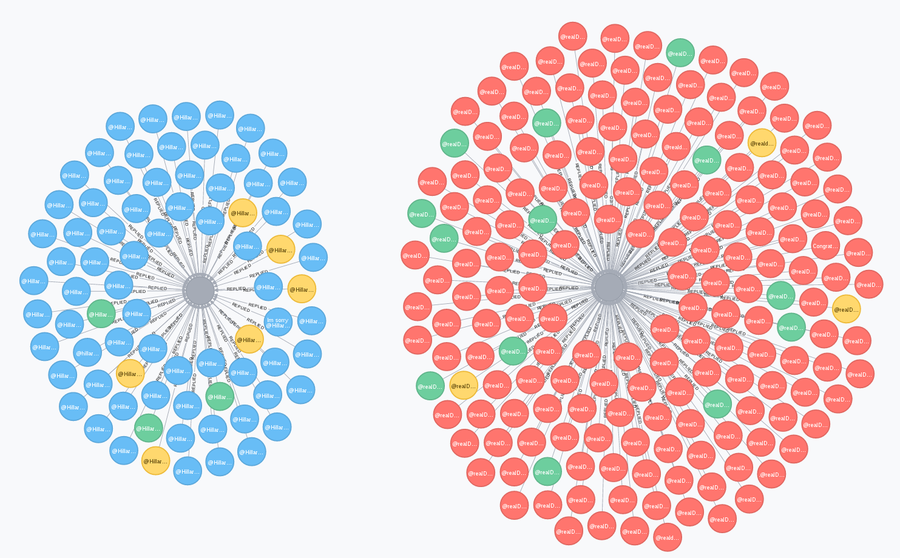
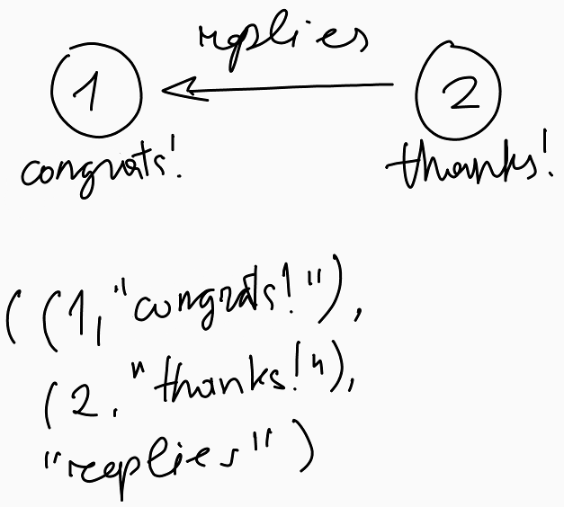
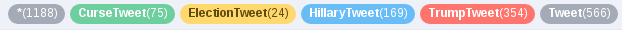

Analysis of the USA election with Apache Spark GraphX
=====================================================



Fig. 1 - The most popular tweets by Hillary Clinton and Donald Trump after the election has ended

Almost right before the election started, I decided that it might have been interesting to analyse what people think and, more importantly, say on this topic. Because, as you know, this election had promised to be an extraordinary one.

This is when I came up with an idea to utilise Twitter's [streaming API](https://dev.twitter.com/streaming/overview) to continuously save vox populi onto disk for its further analysis. So I had been doing this during a period that spans four days - starting from 7th and up to 10th of November with occasional breaks. When I thought that I already have enough of data for some experiments, an ETL task had been performed and the tweets (which were stored as plain text files) had been turned into a DataFrame compressed with [Parquet](https://parquet.apache.org/). This DataFrame has around ten different fields. But for the purpose of this article only these three were used:

- `id` - id of the tweet
- `text` - contents of the tweet
- `inReplyToStatusId` - id of a tweet the original tweet has responded to

Now we have data to play around with. And as the title of the article suggests I will be using [Apache Spark GraphX](http://spark.apache.org/graphx/) functionality for this purpose. GraphX is one of four components built on top of Spark Core engine and it provides API for processing graphs.

The first step is to prepare data for our graph. So let's create an RDD from the raw DataFrame (file [TwitterGraph.scala](src/main/scala/eugenzyx/TwitterGraph.scala)):

```scala
val englishTweetsRDD = inputDataFrame
  .where("lang = \"en\"")    // here I took only tweets in English,
  .map(toTweetSummary)       // mapped them into triples of this format: (id, text, inReplyToStatusId),
  .filter(onlyValidRecords)  // and removed malformed tweets
```

The next reasonable step is to cache the `englishTweetsRDD` RDD in order to avoid repetitive processing of steps in its physical plan, as it is going to be used multiple times:

```scala
englishTweetsRDD.cache()
```

Afterward, we define vertices of the graph:

```scala
val tweetsRDD = englishTweetsRDD.map(tweetToIdTextPairRDD)       // converting tweets to tuples of two elements:
val responsesRDD = englishTweetsRDD.map(responseToIdTextPairRDD) // (id, text)

val vertices = tweetsRDD.union(responsesRDD)                     // and performing a union of the two RDDs
```

And its edges:

```scala
val edges = englishTweetsRDD.map(extractEdges)
```

where `extractEdges` is a function defined in [Transformations.scala](src/main/scala/eugenzyx/Transformations.scala):

```scala
def extractEdges: TweetSummary => Edge[String] = tweetSummary => tweetSummary match {
  case (id, _, inReplyToStatusId) => Edge(id.toLong, inReplyToStatusId.toLong, "Replies")
}
```

Having vertices, edges, and a default vertex we are finally able to define a graph:

```scala
val none = "none" // defining a defaul vertex
val graph = Graph(vertices, edges, none) // defining a graph of tweets
```

This is a directed acyclic graph. It is directed because an edge represents a response to a tweet. And it is acyclic because a tweet can't reply to another tweet that has been posted after the first one. This is also a property graph because for every vertex and edge there is an attached property. The property of a vertex is a tweet's text. For an edge, it is a type of relationship that connects two vertices.

Now, what can we do with this graph? Well, let's first find the most popular tweets. In order to do this, I will be using `inDegrees` function, which returns a collection of tuples containing a VertexId and the number of edges pointing to this vertex. Similarly to `inDegrees`, the Graph has also an `outDegrees` function, but in our context, it isn't very helpful since a tweet can only reply to one tweet at most.

```scala
val popularInDegrees = graph // this will be used later
  .inDegrees
  .sortBy(getCount, descending)
  .take(20)

val popularTweetsIds = popularInDegrees.map(getIds)
```

This got us twenty ids of the tweets with the largest number of replies. Now it would be nice to visualise this data. In order to achieve this, there is a `triplets` method. What it does in detail you can read [here](http://spark.apache.org/docs/latest/graphx-programming-guide.html), but in short, it returns an RDD of tuples of three elements containing two vertices and the edge that connects them, like this:



Fig. 2 - Triplet of two vertices and an edge

```scala
val popularTriplets = graph.triplets
  .filter(triplet => popularTweetsIds.contains(triplet.dstId))
```

Now, when we have this data it is finally possible to visualize it. I want this visualization to show relationship between tweets and quickly answer these questions:

- which tweets mention Donald Trump?
- which tweets mention Hillary Clinton?
- which tweets use offensive language?

I will be looking for answers using Neo4j graph database. And again I'm iterating over the triplets here:

```scala
popularTriplets.collect().foreach { triplet =>
  val session = driver.session()

  val query = s"""
    |MERGE (t1: ${ getTweetType(triplet.srcAttr) } {text:'${ sanitizeTweet(triplet.srcAttr) }', id:'${ triplet.srcId }'})
    |MERGE (t2: ${ getTweetType(triplet.dstAttr) } {text:'${ sanitizeTweet(triplet.dstAttr) }', id: '${ triplet.dstId }', isMostPopular: '${ triplet.dstId == mostRepliedTweet }'})
    |CREATE UNIQUE (t1)-[r:REPLIED]->(t2)""".stripMargin

  Try(session.run(query))

  session.close()
}
```

In this query, we create our graph in a local Neo4j database. Pay attention to the `getTweetType` function (its definition can be found in [TweetUtils.scala](src/main/scala/eugenzyx/TweetUtils.scala)). It parses a tweet and determines its category: TrumpTweet, HillaryTweet, ElectionTweet (for those mentioning both Clinton and Trump) or CurseTweet (containing offensive language).


Finally, after the program has been executed, we can observe the following picture ([high-resolution SVG](_images/graph.svg)):


Fig. 3 - Visualization of the graph



Fig. 4 - Legend for the graph on Fig. 3

So here you can see tweets that mention Donald Trump marked in red, Hillary Clinton - in Blue, both - in yellow, and tweets containing offensive language in green. Any other tweets are grey, as they interest us the least.

The other thing we can find on the graph is the most popular tweet over that period:

```scala
val mostRepliedTweet = popularTweetsIds.head // tweet with maximum number of replies
```

And it is [this](https://twitter.com/realDonaldTrump/status/796315640307060738) tweet sent by Donald Trump as, by that time already, the president-elect of the USA. An interesting thing to note is the amount of obscene language used in response to this tweet - 13. In comparison, the most popular [tweet](https://twitter.com/HillaryClinton/status/796169187882369024) by Hillary Clinton has only 3 curses in response.

Let's calculate what fraction of all the amount of responses do obscene tweets make up and display this on the graph:

```scala
  val mentions =
    popularTriplets
      // show mentions of the candidates for every tweet
      .map { triplet =>
        implicit def booleanToInt(b: Boolean): Int = if (b) 1 else 0

        (triplet.dstId, (isTrumpTweet(triplet.srcAttr): Int, isHillaryTweet(triplet.srcAttr): Int))
      }
      .reduceByKey { case ((l1, l2), (r1, r2)) => (l1 + r1, l2 + r2) } // sum up mentions
      .collect()

  val trumpMostPopular = mentions.maxBy { case (id, (trumpCount, clintonCount)) => trumpCount }._1
  val clintonMostPopular = mentions.maxBy { case (id, (trumpCount, clintonCount)) => clintonCount }._1

  val trumpTotalRepliesCount = popularTriplets.filter(triplet => triplet.dstId == trumpMostPopular).count
  val clintonTotalRepliesCount = popularTriplets.filter(triplet => triplet.dstId == clintonMostPopular).count

  val trumpOffensiveRepliesCount = popularTriplets.filter(triplet => triplet.dstId == trumpMostPopular && isCurseTweet(triplet.srcAttr)).count
  val clintonOffensiveRepliesCount = popularTriplets.filter(triplet => triplet.dstId == clintonMostPopular && isCurseTweet(triplet.srcAttr)).count

  println(s"Total replies to Trump's most popular tweet: $trumpTotalRepliesCount, number of tweets containing curses: $trumpOffensiveRepliesCount, ratio: ${ trumpOffensiveRepliesCount.toFloat / trumpTotalRepliesCount }")
  println(s"Total replies to Clinton's most popular tweet: $clintonTotalRepliesCount, number of tweets containing curses: $clintonOffensiveRepliesCount, ratio: ${ clintonOffensiveRepliesCount.toFloat / clintonTotalRepliesCount }")
```

And the output is:

```
Total replies to Trump's most popular tweet: 183, number of tweets containing curses: 13, ratio: 0.07103825
Total replies to Clinton's most popular tweet: 78, number of tweets containing curses: 3, ratio: 0.03846154
```

So what can we conclude from these results? I suppose, it is that there were more people who were mad about Trump's victory than Clinton's defeat. Keep in mind, however, that twitter's streaming API only outputs 1% of all the tweets that are posted. On top of that, I'll remind you that there were times when I stopped the streaming process for some time and I'm afraid I missed the most interesting part of those days.

Finally, let's use a more suitable algorithm for counting most popular tweets - PageRank. This is an algorithm that was initially invented by founders of Google back when they were students to improve the relevance of search results in a new type of search engine they were working on. The idea behind it is that a document is more important the more times it is referred to in other documents both directly and indirectly (through other intermediate documents). [This video](https://www.youtube.com/watch?v=u8HtO7Gd5q0) explains it in detail.

Luckily, this algorithm can be applied to any graph and is already implemented in GraphX.

```scala
val popularTweetsPageRank = graph
  .staticPageRank(10)
  .vertices
  .sortBy(_._2, descending) // sort by rank
  .take(20)
  .map(_._1) // VertexId
```

And so we have got ids of 20 most popular tweets using PageRank. Although we have used another approach, the result is the same:

```scala
println(popularTweetsIds.toSet == popularTweetsPageRank.toSet) // true
```

Well, that is not entirely true. If we look closely and compare the top tweets as two ordered lists (as opposed to comparison of the sets above, which are not ordered collections, by the way), we would see that there are two swapped tweets:

```scala
popularInDegrees
  .zip(popularPageRank) // zip the results that we have got from two approaches
  .foreach {
    case ((l, _), (r, _)) =>
      println(s"$l $r ${if (l == r) "" else "!"}") // print out ids of the tweets and append an ! if they are not equal
  }

Output:

796315640307060738 796315640307060738
780683171520212992 780683171520212992
796182637622816768 796182637622816768
796169187882369024 796169187882369024
795954831718498305 795954831718498305
796219890239733760 796219890239733760
796394920051441664 796394920051441664
796259238590824449 796259238590824449
796377820091981824 796377820091981824
795737237329743873 795737237329743873
796425920378765313 796425920378765313
796317753749729280 796317753749729280
795743568736481280 795743568736481280
796227455082233858 796227455082233858
796141495573155840 796171467943710720 !
796171467943710720 796141495573155840 !
796220439542439936 796220439542439936
796188203300442112 796188203300442112
796463632972267520 796463632972267520
796171852645355522 796171852645355522

```

Why is there so few differences in the two approaches? The reason behind this is that number of second level replies (reply to a reply to a tweet) in the data set being used is extremely insignificant (again, because of 1% limit that Twitter outputs in their free stream). Furthermore, the top level tweets they reply to are also unpopular (have at most 2 replies) thus having no impact on the actual most popular tweets, which have hundreds of replies:

```scala
val replies = englishTweetsRDD
  // take tweets that are themselves replies:
  .filter(!_._3.isEmpty)
  // get their ids:
  .map(_._1)
  .collect()
  .toSet

val repliesWithRepliesIds = englishTweetsRDD
  // get tweets that reply to replies:
  .filter {
    case (_, _, inReplyToStatusId) => replies(inReplyToStatusId.toString)
  }
  // get ids of first level replies:
  .map(_._3.toLong)
  .collect()
  .toSet

graph
  // get a collection of tuples (VertexId, NumberIncomingEdges):
  .inDegrees
  // get only replies with replies:
  .filter { case (id, _) => repliesWithRepliesIds(id) }
  // sort by number of incoming edges:
  .sortBy(getCount, descending)
  // take top 20 and print them out:
  .take(20)
  .foreach(println)

Output (id, number of replies):

(796188651583655942,2)
(796222914823618561,2)
(796226781980356608,2)
(796627237340520448,1)
(796591040501157888,1)
(796622837540855808,1)
(796141062997819396,1)
(796572627531890689,1)
(796177092077559808,1)
(796447414961967104,1)
(796428863568019460,1)
(796512841918480384,1)
(795739009616121856,1)
(796596354709671936,1)
(796459909814554628,1)
(796500472911851520,1)
(796420030367989761,1)
(796491488691621892,1)
(796154228934778880,1)
(796478276663382016,1)
```

In conclusion, it's just a small and, hopefully, an interesting fraction of what can be done with GraphX. It also includes other algorithms for operations on graphs comprised of large data sets and I hope that we will see more such stuff in future articles. But that's it for today.
