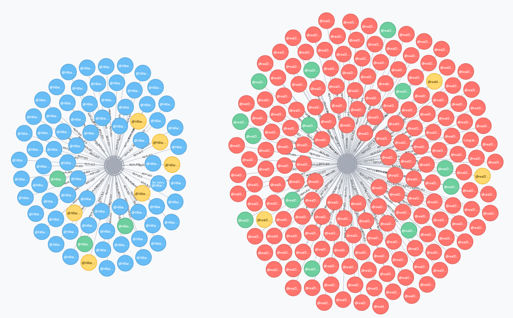

Анализ выборов в США с помощью Apache Spark GraphX
==================================================



Рис. 1 - Наиболее популярные твиты, опубликованные Хиллари Клинтон и Дональдом Трампом после завершения выборов

Почти сразу перед тем, как начались выборы, я решил, что, возможно, было бы интересно проанализировать что люди думают и что говорят на эту тему, поскольку, как известно, эти выборы обещали быть необыкновенными.

В этот момент мне и пришла в голову мысль использовать [стриминговое API](https://dev.twitter.com/streaming/overview) Твиттера для непрерывного сохранения vox populi на диск для его дальнейшего анализа. Стриминг происходил в течение четырёх дней - с седьмого по десятое ноября с периодическими перерывами. Когда я решил, что имеется уже достаточное количество данных для экспериментов, был произведён ETL процесс преобразования твитов (которые хранились в текстовом формате) в DataFrame, сжатый с использованием [Parquet](https://parquet.apache.org/). В данном датафрейме было приблизительно десять полей, из которых для данной статьи использовались лишь следующие три:

- `id` - идентификатор твита
- `text` - содержание твита
- `inReplyToStatusId` - иднтификатор твита, на который данный твит "ответил"

Итак, теперь у нас есть данные, над которыми уже можно производить какие-либо операции. Как видно из названия статьи, для эксперимента я буду использовать функциональность [Apache Spark GraphX](http://spark.apache.org/graphx/). GraphX является одним из четырёх компонентов, основывающихся на Spark Core и предоставляет API для обработки графов.

Первый шаг — подготовка данных для нашего графа. Давайте создадим RDD из исходного датафрейма (см. файл [TwitterGraph.scala](src/main/scala/eugenzyx/TwitterGraph.scala)):

```scala
val englishTweetsRDD =
  inputDataFrame
    .where("lang = \"en\"")    // берём твиты только на английском языке
    .map(toTweetSummary)       // отображаем их в тройки такого формата: (id, text, inReplyToStatusId),
    .filter(onlyValidRecords)  // отфильтровываем твиты, не прошедшие проверку на валидность
```

Следующий рациональный шаг - это кэширование RDD, который мы назвали `englishTweetsRDD` для того, чтобы избежать повторной обработки шагов его физического плана, поскольку он будет использоваться несколько раз:

```scala
englishTweetsRDD.cache()
```

Далее мы определяем вершины графа:

```scala
val tweetsRDD = englishTweetsRDD map tweetToIdTextPairRDD       // отображаем твиты в кортежи состоящие из двух элементов:
val responsesRDD = englishTweetsRDD map responseToIdTextPairRDD // (id, text)

val vertices = tweetsRDD union responsesRDD                     // и производим объединения только что полученных RDD
```

И его рёбра:

```scala
val edges = englishTweetsRDD map extractEdges
```

где `extractEdges` представляет собой функцию, определённую в [Transformations.scala](src/main/scala/eugenzyx/Transformations.scala):

```scala
def extractEdges: TweetSummary => Edge[String] = tweetSummary => tweetSummary match {
  case (id, _, inReplyToStatusId) => Edge(id.toLong, inReplyToStatusId.toLong, "Replies")
}
```

Теперь, когда мы имеем вершины, рёбра и вершину по-умолчанию (default vertex), мы наконец можем определить граф:

```scala
val none = "none" // определяем вершину по-умолчанию
val graph = Graph(vertices, edges, none) // определяем граф, состоящий из публикаций в твиттере
```

Это направленный ациклический граф. Направленный он потому, что каждое его ребро представляет ответ на твит. А ациклический - потому, что твит не может отвечать на твиты, которые появились позже него. Кроме того, это также и так называемый property graph, потому что каждой его вершине и ребру соответствует определённый набор свойств (атрибутов). Свойством вершины является текст твита, а свойством ребра - тип отношения, связывающего две вершины (в нашем случае отношение "ответил").

Что же мы можем теперь делать с этим графом? Ну, давайте сначала найдём наиболее популярные твиты. Для того чтобы сделать это, я буду использовать функцию `inDegrees`, которая возвращает коллекцию кортежей, содержащих идентификатор вершины и количество рёбер, восходящих к этой вершине. Кроме `inDegrees` у графа еще есть и другая похожая функция - `outDegrees`, но в нашем случае она не очень полезна, поскольку твит может отвечать максимум на один другой твит.

```scala
val popularInDegrees = graph // будет использовано далее
  .inDegrees
  .sortBy(getCount, descending)
  .take(20)

val popularTweetsIds = popularInDegrees.map(getIds)
```

Таким образом мы получили двадцать идентификаторов твитов с наибольшим количеством ответов. Теперь было бы неплохо визуализировать эти данные. И для того чтобы добиться этого, существует метод `triplets`. Как он работает, в подробностях вы можете прочитать [здесь](http://spark.apache.org/docs/latest/graphx-programming-guide.html). Вкратце, он возвращает RDD, состоящий из кортежей из трёх элементов - двух вершин и ребра, их соединяющего:


Рис. 2 - Тройка, состоящая из двух вершин и ребра

```scala
val popularTriplets = graph
  .triplets
  .filter(popularTweetsIds contains _.dstId)
```

Теперь, когда у нас есть эти данные, мы можем визуализировать их. Я хочу, чтобы визуализация отображала отношения между твитами и сразу отвечала на следующие вопросы:

- какие твиты упоминают Дональда Трампа?
- какие твиты упоминают Хиллари Клинтон?
- какие твиты используют ненормативную лексику?

Ответы на эти вопросы я буду искать, используя графовую базу данных Neo4j. И для этого я снова прибегаю к использованию троек:

```scala
popularTriplets.collect().foreach { triplet =>
  val session = driver.session()

  val query = s"""
    |MERGE (t1: ${ getTweetType(triplet.srcAttr) } {text:'${ sanitizeTweet(triplet.srcAttr) }', id:'${ triplet.srcId }'})
    |MERGE (t2: ${ getTweetType(triplet.dstAttr) } {text:'${ sanitizeTweet(triplet.dstAttr) }', id: '${ triplet.dstId }', isMostPopular: '${ triplet.dstId == mostRepliedTweet }'})
    |CREATE UNIQUE (t1)-[r:REPLIED]->(t2)""".stripMargin

  Try(session.run(query))

  session.close()
}
```

В данном запросе мы создаём наш граф в локальной базе данных Neo4j. Обратите внимание на функцию `getTweetType` (её определение находится в [TweetUtils.scala](src/main/scala/eugenzyx/TweetUtils.scala)). Она производит структурный анализ текста твита и классифицирует его в одну из следующих категорий: TrumpTweet, HillaryTweet, ElectionTweet (для твитов, упоминающих и Трампа и Клинтон) или CurseTweet (содержащие ненормативную лексику).

Наконец, после того, как программа закончит своё выполнения, мы видим следующую картину ([SVG в высоком разрешении](_images/graph.svg)):


Рис. 3 - Визуализация графа


Fig. 4 - Легенда к графу на рис. 3

Итак, здесь видно, что твиты, упоминающие Дональна Трампа выделены красным, Хиллари Клинтон — синим, обоих кандидатов — жёлтым, а твиты, содержащие ругательства — зелёным. Все остальные твиты отмечены серым, так как представляют для нас наименьший интерес.

Другая вещь, которую мы можем найти в графе — это самый популярный твит за тот период:

```scala
val mostRepliedTweet = popularTweetsIds.head // твит с наибольшим количеством ответов
```

И это [этот](https://twitter.com/realDonaldTrump/status/796315640307060738) твит, который отправил Дональд Трамп, когда уже стал избранным президентом США. Интересный факт, на который я бы хотел обратить ваше внимание: количество твитов, отправленных в ответ на тот твит и при этом содержащих нецензурную лексику, составляет 13 штук. Для сравнения, самый популярный [твит](https://twitter.com/HillaryClinton/status/796169187882369024) Хиллари Клинтон имеет только лишь 3 ругательства в ответ.

Давайте посчитаем соотношение всего количества ответов к ответам, содержащим ругательства:

```scala
  val trumpMostPopular = 796315640307060738L // идентификаторы популярнейших твитов были взяты с визуального представления графа
  val clintonMostPopular = 796169187882369024L

  val trumpTotalRepliesCount = popularTriplets.filter(triplet => triplet.dstId == trumpMostPopular).count
  val clintonTotalRepliesCount = popularTriplets.filter(triplet => triplet.dstId == clintonMostPopular).count

  val trumpOffensiveRepliesCount = popularTriplets.filter(triplet => triplet.dstId == trumpMostPopular && isCurseTweet(triplet.srcAttr)).count
  val clintonOffensiveRepliesCount = popularTriplets.filter(triplet => triplet.dstId == clintonMostPopular && isCurseTweet(triplet.srcAttr)).count

  println(s"Total replies to Trump's most popular tweet: $trumpTotalRepliesCount, number of tweets containing curses: $trumpOffensiveRepliesCount, ratio: ${ trumpOffensiveRepliesCount.toFloat / trumpTotalRepliesCount }")
  println(s"Total replies to Clinton's most popular tweet: $clintonTotalRepliesCount, number of tweets containing curses: $clintonOffensiveRepliesCount, ratio: ${ clintonOffensiveRepliesCount.toFloat / clintonTotalRepliesCount }")
```

И вывод:

```
Total replies to Trump's most popular tweet: 183, number of tweets containing curses: 13, ratio: 0.07103825
Total replies to Clinton's most popular tweet: 78, number of tweets containing curses: 3, ratio: 0.03846154
```

Какой можно сделать из этого вывод? Полагаю, такой, что людей, огорченных победой Трампа было больше, чем тех, кто был огорчён поражением Клинтон. Не забывайте, однако, что стриминговое API Твиттера выводит лишь 1% от всех публикаций. Кроме того, напомню, что были периоды, когда я прекращал процесс стриминга, поэтому, боюсь, я мог пропустить самую интересную часть тех дней.

Наконец, давайте используем более подходящий алгоритм для подсчёта самых популярных твитов — PageRank. Это алгоритм, который изначально был придуман основателями Google ещё в те дни, когда они были студентами, для улучшения релевантности поисковой выдачи в новом типе поисковой системы, над которой они работали. Идея заключается в том, что документ тем "важнее", чем больше у него отсылок к себе в других документах, как прямо, так и косвенно, посредством промежуточных документов. [Это видео](https://www.youtube.com/watch?v=u8HtO7Gd5q0) подробно описывает принцип.

К счастью, этот алгоритм может быть применён к любому графу и уже реализован в GraphX.

```scala
val popularTweetsPageRank = graph
  .staticPageRank(10)
  .vertices
  .sortBy(_._2, descending) // сортируем по рангу
  .take(20)
  .map(_._1) // VertexId
```

Здесь мы получили идентификаторы двадцати наиболее популярных твитов, используя PageRank. Итак, используя другой подход, мы видим всё тот же результат:

```scala
println(popularTweetsIds.toSet == popularTweetsPageRank.toSet) // true
```

Хотя это и не совсем правда. Если внимательно посмотреть и сравнить эти две двадцатки, включая порядок элементов (в противовес сравнению множеств, которые, к слову, являются неупорядоченными коллекциями), мы увидим, что есть два твита, поменяных местами:

```scala
(popularInDegrees zip popularPageRank)             // соединяем результаты полученные в результате двух подходов в кортежи
  .foreach { case ((l, _), (r, _)) =>
    println(s"$l $r ${ if (l == r) "" else "!" }") // выводим идентификаторы твитов и добавляем "!" если они не равны
  }

Output:

796315640307060738 796315640307060738
780683171520212992 780683171520212992
796182637622816768 796182637622816768
796169187882369024 796169187882369024
795954831718498305 795954831718498305
796219890239733760 796219890239733760
796394920051441664 796394920051441664
796259238590824449 796259238590824449
796377820091981824 796377820091981824
795737237329743873 795737237329743873
796425920378765313 796425920378765313
796317753749729280 796317753749729280
795743568736481280 795743568736481280
796227455082233858 796227455082233858
796141495573155840 796171467943710720 !
796171467943710720 796141495573155840 !
796220439542439936 796220439542439936
796188203300442112 796188203300442112
796463632972267520 796463632972267520
796171852645355522 796171852645355522

```

Почему разница столь незначительна? Причина кроется в том, что количество ответов второго уровня (ответов на ответ на твит) в используемом наборе данных крайне мало (снова напомню, что это из-за ограничения в 1%, накладываемом твиттером в их публичном потоке). Кроме того, твиты верхнего уровня, на которые они (ответы второго уровня) отвечают, также являются непопулярными (имеют не более двух ответов), тем самым не оказывая влияния на самые популярные публикации:

```scala
val replies = englishTweetsRDD
  // возьмём твиты, которые сами по себе являются ответами:
  .filter(!_._3.isEmpty)
  // возьмём их идентификаторы
  .map(_._1)
  .collect()
  .toSet

val repliesWithRepliesIds = englishTweetsRDD
  // найдём твиты, которые отвечают на ответы
  .filter { case (_, _, inReplyToStatusId) => replies(inReplyToStatusId.toString) }
  // получим идентификаторы ответов первого уровня:
  .map(_._3.toLong)
  .collect()
  .toSet

graph
  // возьмём коллекцию кортежей типа (идентификатор вершины, количество восходящих к ней рёбер)
  .inDegrees
  // выберем лишь ответы с ответами:
  .filter { case (id, _) => repliesWithRepliesIds(id) }
  // отсортируем по количеству восходящих рёбер:
  .sortBy(getCount, descending)
  // возьмём двадцать верхних твитов и выведем:
  .take(20)
  .foreach(println)

Вывод (идентификатор, количество ответов):

(796188651583655942,2)
(796222914823618561,2)
(796226781980356608,2)
(796627237340520448,1)
(796591040501157888,1)
(796622837540855808,1)
(796141062997819396,1)
(796572627531890689,1)
(796177092077559808,1)
(796447414961967104,1)
(796428863568019460,1)
(796512841918480384,1)
(795739009616121856,1)
(796596354709671936,1)
(796459909814554628,1)
(796500472911851520,1)
(796420030367989761,1)
(796491488691621892,1)
(796154228934778880,1)
(796478276663382016,1)
```

В заключение, это лишь малая и, надеюсь, интересная часть того, что можно делать с помощью GraphX. Он также включает в себя другие алгоритмы для операций над графами, состоящими из больших наборов данных. В своих следующих статьях я собираюсь рассмотреть ещё несколько подобных вещей, но на сегодня это всё.
